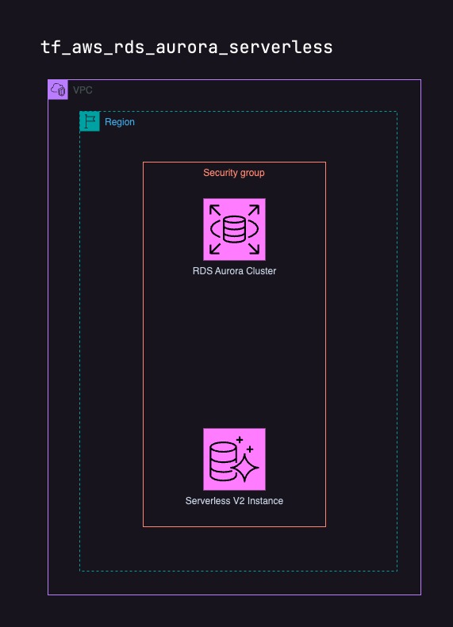

# tf_aws_rds_aurora_serverless

The tf_aws_rds_aurora_serverless repository provides Terraform scripts to deploy an Amazon RDS Aurora MySQL 8 Serverless database. It sets up the following:

	•	RDS Cluster: Aurora MySQL 8 Serverless with customizable capacity.
	•	Security Group: Controls access to the RDS cluster.
	•	Parameter Groups: For configuring database parameters.
	•	VPC Integration: Links the RDS cluster to a specified VPC.

Key Inputs:

	•	Application name
	•	VPC ID
	•	Admin username
	•	Database name

Outputs:

	•	Database name
	•	Admin credentials
	•	Cluster endpoint
	•	Security group ID

## Security considerations
This Terraform was validated using [Trivy](https://aquasecurity.github.io/trivy/v0.52/). You'll find the report in [SECURITY](./SECURITY). 

* Performance Insights are disable as default since the ACU is set to minimum as default. This can be overwritten through variables.
* It's intended not to use customer managed encryption keys in the current version.

## Requirements

| Name | Version |
|------|---------|
|  [aws](#requirement\_aws) | ~> 5 |

## Providers

| Name | Version |
|------|---------|
|  [aws](#provider\_aws) | ~> 5 |
|  [random](#provider\_random) | n/a |

## Modules

No modules.

## Resources

| Name | Type |
|------|------|
| [aws_db_parameter_group.default](https://registry.terraform.io/providers/hashicorp/aws/latest/docs/resources/db_parameter_group) | resource |
| [aws_rds_cluster.prod](https://registry.terraform.io/providers/hashicorp/aws/latest/docs/resources/rds_cluster) | resource |
| [aws_rds_cluster_instance.instances](https://registry.terraform.io/providers/hashicorp/aws/latest/docs/resources/rds_cluster_instance) | resource |
| [aws_rds_cluster_parameter_group.default](https://registry.terraform.io/providers/hashicorp/aws/latest/docs/resources/rds_cluster_parameter_group) | resource |
| [aws_security_group.rds_access](https://registry.terraform.io/providers/hashicorp/aws/latest/docs/resources/security_group) | resource |
| [random_string.rds_password](https://registry.terraform.io/providers/hashicorp/random/latest/docs/resources/string) | resource |
| [aws_vpc.selected](https://registry.terraform.io/providers/hashicorp/aws/latest/docs/data-sources/vpc) | data source |

## Inputs

| Name | Description | Type | Default | Required |
|------|-------------|------|---------|:--------:|
|  [admin\_username](#input\_admin\_username) | The username for the RDS admin user | `string` | `"admin"` | no |
|  [applicationName](#input\_applicationName) | The name of the application | `string` | n/a | yes |
|  [cluster\_backup\_retention\_period](#input\_cluster\_backup\_retention\_period) | The number of days to retain backups for the Aurora Serverless v2 cluster | `number` | `7` | no |
|  [db\_name](#input\_db\_name) | The name of the database | `string` | `"ebdb"` | no |
|  [performance\_insights\_enabled](#input\_performance\_insights\_enabled) | Enable Performance Insights for the RDS cluster. Default is false. Set at least 2ACU as minimum capacity for Performance Insights to work. | `bool` | `false` | no |
|  [serverlessv2\_max\_capacity](#input\_serverlessv2\_max\_capacity) | The maximum capacity for the Aurora Serverless v2 cluster | `number` | `1` | no |
|  [serverlessv2\_min\_capacity](#input\_serverlessv2\_min\_capacity) | The minimum capacity for the Aurora Serverless v2 cluster | `number` | `0.5` | no |
|  [vpc\_id](#input\_vpc\_id) | The ID of the VPC | `string` | n/a | yes |

## Outputs

| Name | Description |
|------|-------------|
|  [db\_name](#output\_db\_name) | The name of the database |
|  [rds\_admin\_password](#output\_rds\_admin\_password) | The password for the RDS admin user |
|  [rds\_admin\_username](#output\_rds\_admin\_username) | The username for the RDS admin user |
|  [rds\_endpoint](#output\_rds\_endpoint) | The endpoint for the RDS cluster |
|  [rds\_security\_group\_id](#output\_rds\_security\_group\_id) | The ID of the security group that controls access to the RDS cluster |
